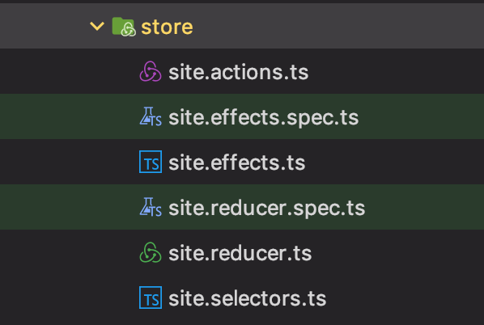

# Coding style guide

I am definitely following the [angular style guide](https://angular.io/guide/styleguide) . Here are a few more details specific to the project.

## Nomenclature

### Modules

**Do** use the singular form cause they represent an entity/domain: rule, search, contact, admin, client, customer, etc.

**Consider** using the plural form if there is a good reason to not follow the previous rule.

**Why?** It is clearer and less confusing, it avoids wondering every time for names and paths whether there is an 's' or not.

### Model

**Do** use the 'model' literal to represent entities. For technical reasons, I put all models in `core/model`. Putting them in the core module is logic cause they might be used in several feature modules.

**Why?** This is logic as we are already following angular style guide for components, services, etc. The idea is to identify quickly what a file contains.
It is tolerated to create its own namespace when that makes sense. I think the entity is a strong type of object in any app. Plus, we will have more than one.

### Mocks

**Do** suffix the name with '-mock'.

Mocks reside in their own module. There is one mock file per model containing a local memory database of entities for that model.

**Why?** So we can identify and locate them quickly.

### NGRX

**Do** suffix the name with one of: actions, reducer, selectors, effects.



**Why** NGRX is quite verbose. It helps a lot to separate concepts in their own file.

### Material Theme

**Do** create a second scss file for styles theme related.
**Do** suffix this file with `theme`

Example: 

- activity-indicator.component.scss: declare structure styles for the component that do not change when the theme change
- _activity-indicator.theme.scss: declare styles depending on theme that receive the theme as a parameter. This file is not declared in the component. It is imported in each theme => see `styles/material/themes/`.

```scss
@mixin navbar-theme($theme) {

    $primary:map_get($theme, primary);
    $accent:map_get($theme, accent);
    $foreground:map-get($theme, foreground);
    $background:map-get($theme, background);

    ba-navbar {
        border-bottom:2px solid map-get($foreground, divider);
        a.active {
            color:mat-color($accent);
        }
    }

    @include media('<=xs') {
        ba-navbar {
            nav {
                background-color:mat-color($background, app-bar);
            }
        }
    }
}
```

You might also want to declare styles dependent on the typography:

```scss
@mixin good-search-typography($typography-config) {

    ba-good-search{
        .mat-form-field-label-wrapper {
           font-family: mat-font-family($typography-config);
        }
    }
}
```

**Why** It is one solution to handle theming efficiently. There are others but this one is aligned with angular material recommendations.


# Angular modules

## Core

Contains everything that will be loaded on startup and must be loaded only once. Transverse code goes generally there.
A nice optimisation would be to create a critical module that contains the strict minimum and lazy load the core module just after.

You can't load it more than once, there will be an error if you do.

### Generic Errors

The `network` sub-folder in `CoreModule` contains an HTTP interceptor that process generic network errors. 
When an error is processed there, the property `processed` is setted in the error so that components receiving it can adapt their behavior in consequence. 

### Base component

All components should inherit `BaseComponent`. It contains a `done` subject that can be used to unregister all subscriptions when component is destroyed.

```typescript
    this.store.pipe(
        select(siteSelectors.selectError),
        filter((err:AppError) => err != null && !err.processed),
        takeUntil(this.done)
    ).subscribe(
        (err) => {
            this.snackbar.showError('Server is temporarily unavailable');
        }
    );
```

## Mocks

Everything mock related is in the mock module notably the `MockService` which define a memory database intercepting http requests.
The module is declared in the `CoreModule`. Unfortunately you can't declare mocks for a feature module inside that module. All mocks must be declared at once. This is a limitation of `angular-in-memory-web-api`. 

## Shared

Contains common components that can be loaded more than once.

## Features module

Each feature should be developed in its own module and be eventually loaded lazily.
For modules using ngrx/redux, I recommend to create a `store` folder with ngrx configuration. No need to centralize all ngrx code, it can be lazy loaded.


# Angular Material

TODO
